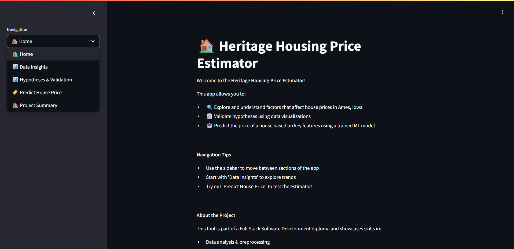
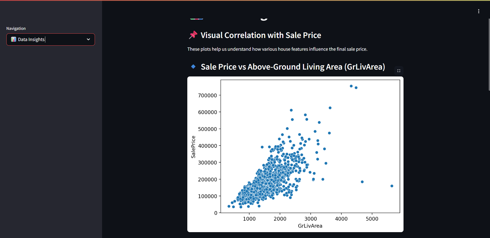
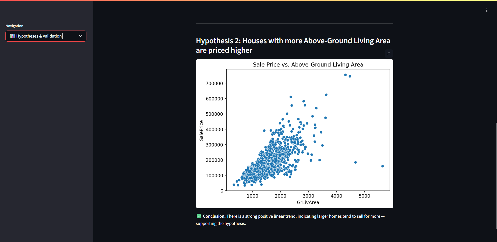
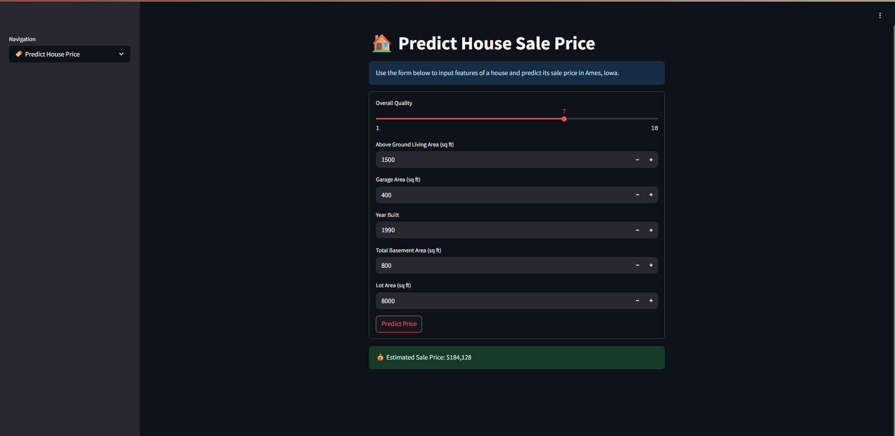

# 🏠 Heritage Housing Price Estimator

This Streamlit-based web app is being developed as part of a Diploma in Full Stack Software Development final project. It is a predictive analytics tool designed to estimate house prices in Ames, Iowa, using a dataset sourced from a public Kaggle repository.

---

## 📌 Project Purpose

The aim of this project is to assist users — such as homeowners, property investors, or analysts — in understanding which features most strongly influence house prices in Ames, Iowa, and to provide a predicted sale price based on specific property attributes.

The app will:
- Deliver data-driven insights using machine learning
- Allow users to input house features and receive price predictions
- Present intuitive dashboards for exploratory data analysis (EDA)

---

## 🌟 App Preview

| Home | Data Insights |
|------|---------------|
|  |  |

| Hypothesis Validation | Price Prediction |
|-----------------------|------------------|
|  |  |

---

## 🗂️ Project Structure (to date)

heritage-housing-app/\
├── app_pages/ # Streamlit UI pages\
├── data/ # Raw input datasets\
│ ├── house_prices_records.csv\
│ ├── inherited_houses.csv\
│ └── house-metadata.txt\
├── notebooks/ # Development notebooks\
│ └── 01_data_exploration.ipynb\
├── src/ # Python modules (preprocessing, prediction logic)\
├── streamlit_app.py # Main entry point for the web app\
├── requirements.txt # Dependencies\
├── setup.sh # Heroku deployment script\
├── Procfile # Heroku process file\
└── README.md # This file

---

## 📊 Completed Tasks (So Far)

### ✅ Data Upload

The following datasets have been collected and stored in the `data/` folder:

- `house_prices_records.csv`: Core dataset from Ames, Iowa

- `inherited_houses.csv`: A smaller test set for prediction purposes

- `house-metadata.txt`: Supporting documentation for variables

### ✅ Data Exploration

In `01_data_exploration.ipynb`, the following have been completed:

- Dataset shape and summary statistics

- Identification of missing values

- Count of duplicate records

- Initial visualizations of key outliers (`SalePrice`, `GrLivArea`, `LotArea`)

### ✅ Data Cleaning

In `02_data_cleaning.ipynb`, the following cleaning steps were completed:

- **Duplicates removed** to prevent bias in modeling
- **Columns with >30% missing data** were dropped to simplify handling
- **Numerical columns** had missing values filled with the **median**
- **Categorical columns** had missing values filled with the **mode**
- The `SalePrice` column was **log-transformed** to reduce skewness in the target variable
- The cleaned dataset was saved as `house_prices_cleaned.csv` in the `data/` folder

### ✅ Feature Engineering

In `03_feature_engineering.ipynb`, the following preprocessing tasks were completed:

- Loaded the cleaned dataset
- Applied **One-Hot Encoding** to all categorical features using `pd.get_dummies()`
- Dropped the original `SalePrice` column (we will use the log-transformed version for modeling)
- Saved the fully preprocessed dataset as `house_prices_preprocessed.csv` in the `data/` folder

### ✅ Modeling & Evaluation

In `04_model_training.ipynb`, a Linear Regression model was trained to predict house sale prices using the log-transformed `SalePrice_log` as the target. Key steps:

-   Selected six predictive features:\
    `OverallQual`, `GrLivArea`, `GarageArea`, `YearBuilt`, `TotalBsmtSF`, `LotArea`

-   Built a `scikit-learn` pipeline to handle missing values and fit the model

-   Split the data into **training and test sets**

-   Evaluated the model performance:

    -   **R² Score:** *0.842*

    -   **RMSE:** *0.172*

-   Plotted **actual vs. predicted** values for test set to validate predictions

-   Saved the trained pipeline as `linreg_model.joblib` in the models/ directory.”

### ✅ Streamlit Interface: Project Summary Page

- Implemented the `MultiPage` helper class to enable sidebar navigation between different app pages
- Created `page_project_summary.py` to serve as the landing page for the Streamlit app
- The summary page outlines the project goals, objectives, and tools used
- Registered the page inside `streamlit_app.py` for streamlined navigation

### ✅ Streamlit Interface: Data Insights Page

- Created `page_data_visuals.py` to present key exploratory data visualisations
- Added three key plots to explore correlation with house prices:
  - **Scatter plot** of `SalePrice` vs `GrLivArea` (Above-Ground Living Area)
  - **Box plot** of `SalePrice` vs `OverallQual` (Overall House Quality)
  - **Heatmap** of top 10 numeric features most correlated with `SalePrice`
- Registered the page in `streamlit_app.py` for sidebar navigation
- Highlighted strong predictors such as `GrLivArea`, `OverallQual`, and `GarageArea`

### ✅ Streamlit Interface: Predict House Price Page

- Added a page titled **"Predict House Price"** to the Streamlit app using the `MultiPage` system.
- This page allows users to input specific house attributes such as:
  - Overall Quality
  - Above-Ground Living Area
  - Garage Area
  - Year Built
  - Total Basement Area
  - Lot Area
- When the form is submitted, the app uses the trained Linear Regression model to predict the house price.
- The model predicts a log-transformed sale price, which is then converted back to dollars using `np.expm1()`.
- Displays the result in an easy-to-read format such as:  
  `💰 Estimated Sale Price: $217,000`

### ✅ Streamlit Interface: Hypothesis & Validation Page

- Created a page to present and validate key project hypotheses using visualizations.
- Hypotheses tested:
  1. **Overall Quality** is positively correlated with **Sale Price**
     - Validated using a **box plot**, showing clear upward trend in price by quality level.
  2. **Above-Ground Living Area** is positively correlated with **Sale Price**
     - Validated using a **scatter plot**, revealing a strong linear trend.
- Data used was the cleaned dataset (`house_prices_cleaned.csv`).
- Visuals generated using `Seaborn` and `Matplotlib`.

---

## 🚀 Deployment

- The application is deployed on **Heroku** and accessible online.
- The deployed app includes all functionality:
  - Project summary
  - Exploratory data visuals
  - Hypothesis testing
  - House price prediction using a trained Linear Regression model
- Model artifacts (`linreg_model.joblib`) are stored in the `models/` directory and loaded on demand.

🔗 **Live App:** [https://heritage-housing-2025-04528934543f.herokuapp.com](https://heritage-housing-2025-04528934543f.herokuapp.com)

---

## 📚 Data Source

This project uses the [Ames Housing Dataset](https://www.kaggle.com/codeinstitute/housing-prices-data) provided by Code Institute on Kaggle.

---

## 📎 Acknowledgements

This project is developed as part of the Full Stack Diploma at Code Institute. Dataset courtesy of Kaggle (public domain). Guidance and feedback from project mentors and course materials are acknowledged.